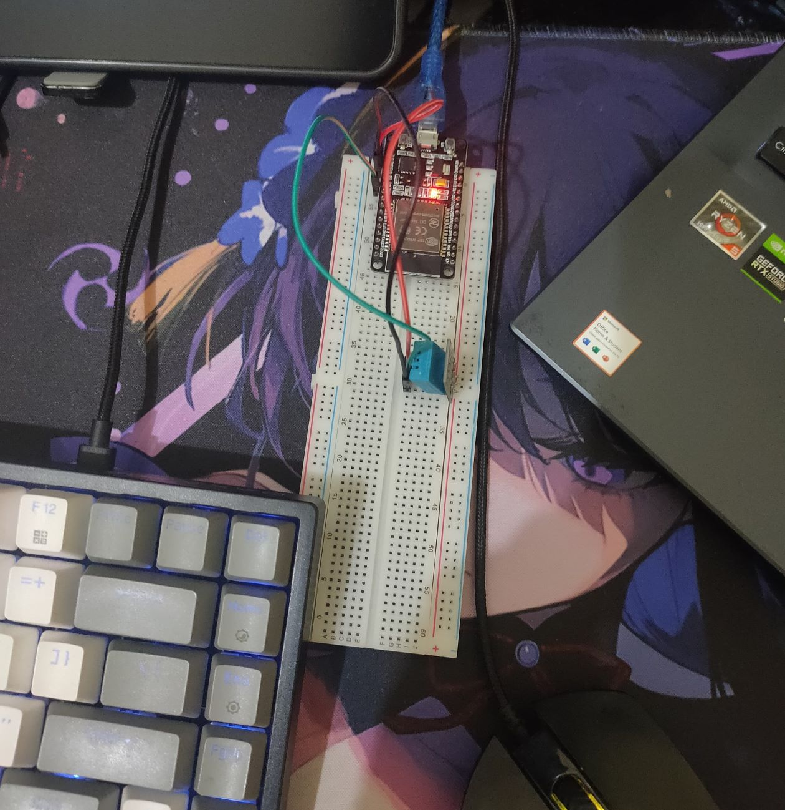
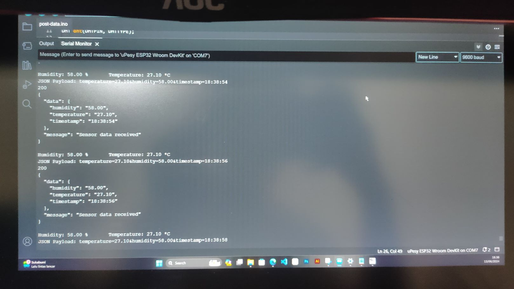

# Humidity IoT System

This repository contains the source code and documentation for the Humidity IoT System, developed as part of the SIC 5 assignment. The project involves a Flask web application that interacts with a DHT11 sensor connected to an ESP32 microcontroller to monitor and display humidity levels.

## Table of Contents

- [Introduction](#introduction)
- [Features](#features)
- [Hardware Requirements](#hardware-requirements)
- [Software Requirements](#software-requirements)
- [Documentation](#documentation)

## Introduction

The Humidity IoT System is designed to monitor humidity levels in real-time. Data is collected using a DHT11 sensor connected to an ESP32 microcontroller, which then communicates with a Flask-based web application. This system allows users to view current and historical humidity data through a user-friendly web interface.

## Features

- Real-time humidity monitoring
- Historical data visualization
- User-friendly web interface built with Flask
- Lightweight and efficient communication between ESP32 and Flask server

## Hardware Requirements

- **ESP32 microcontroller**
- **DHT11 humidity sensor**
- **Breadboard and connecting wires**
- **Power supply for ESP32**

## Software Requirements

- **Python 3.x**
- **Flask**
- **Arduino IDE**
- **Additional Python libraries**: `Flask-CORS`, `requests`

## Documentation

